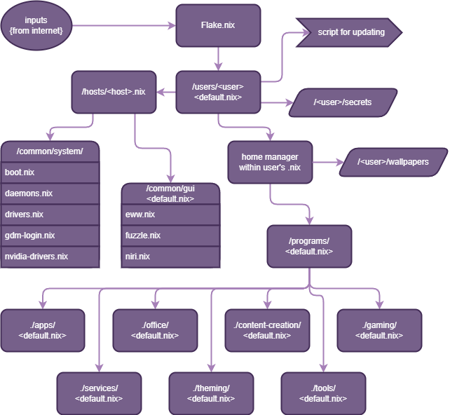

*How are you here? This is designed for one of four people, and three of them don't know Nix from Nil.*




## TO INSTALL:

* Step 1: Install NixOS using a graphical installer.
  * For name and username, select from: yoink, dame, mac, & hamster. This will be your ``` <user> ``` in step 6.
  * Choose a temporary password, and check both 'login automatically,' and 'reuse password for administrator.'
  * Select 'no desktop' when prompted.
  * Finally, partition the hard drive you're installing NixOS to, selecting the 'swap but no hibernate' option.


* Step 2: Reboot, removing the installation media.


* Step 3: In the terminal prompt you're presented with, run the following:
 
    ``` export NIX_CONFIG="experimental-features = nix-command flakes" ```

* Step 4: Run, providing the root password when prompted. Replace ```<user>``` with the user you selected in step one. (yoink, dame, mac, or hamster)

    ``` sudo mkdir -p -m 755 /home/<user>/dotfiles ```

* Step 5: Run the following, replacing ```<user>``` with the user you selected in step one. (yoink, dame, mac, or hamster)

    ``` sudo nixos-install --flake github/spiritofyoink/dotfiles/tree/main --root /home/<user>/dotfiles ```


* Step 6: Reboot. You should now be in NixOS.


> [!NOTE]
> From now on, you simply need to use 'rebuild' to rebuild and switch the system configuration. This currently doesn't work.


If you're debugging, include the following lines in /etc/nixos/configuration.nix

    programs.git.enable = true;
    nix.settings.experimental-features = "nix-command flakes";
